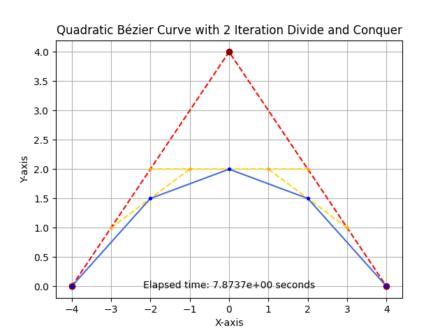
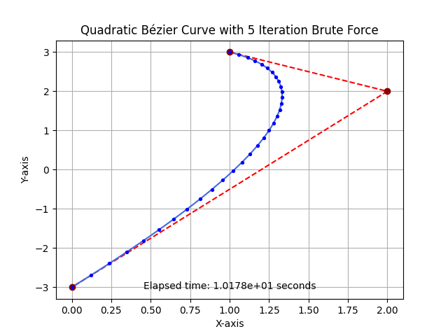
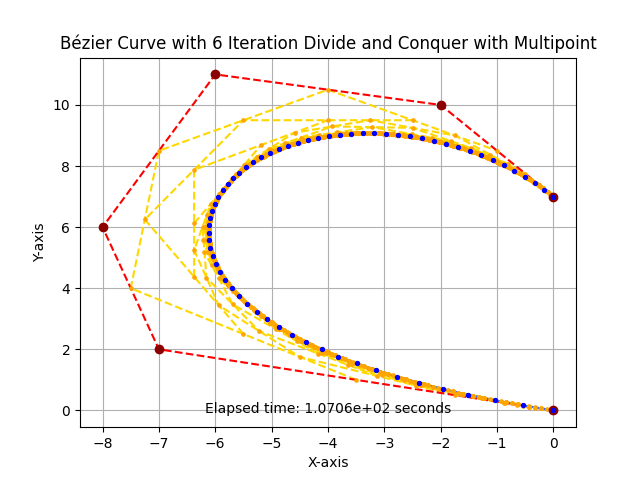
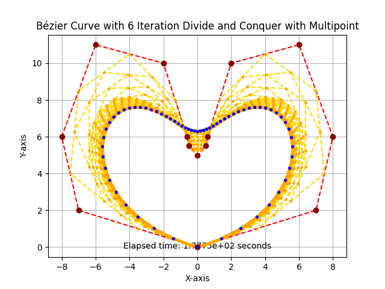

# Tucil2_13522069_13522104
> Membangun Kurva Bézier dengan Algoritma Titik Tengah berbasis Divide and Conquer

## Table of Contents
* [General Info](#general-information)
* [Technologies Used](#technologies-used)
* [Features](#features)
* [Screenshots](#screenshots)
* [Setup](#setup)
* [Usage](#usage)
* [Project Status](#project-status)
* [Room for Improvement](#room-for-improvement)
* [Acknowledgements](#acknowledgements)
* [Contact](#contact)
<!-- * [License](#license) -->


## General Information
Kurva Bézier adalah kurva halus yang sering digunakan dalam desain grafis, animasi, dan manufaktur. Kurva ini dibuat dengan menghubungkan beberapa titik kontrol, yang menentukan bentuk dan arah kurva. Program ini bertujuan untuk mengimplementasikan pembentukan kurva Bézier dengan Algoritma Divide and Conquer serta Algoritma Brute Force sebagai pembanding

Implementasi dari Algoritma Divide and Conquer dapat ditemukan di file _quadraticBezierDnC.py_ dan _multipointBezierDnC.py_ pada strutktur:
```
src/quadraticBezierDnC.py
src/multipointBezierDnC.py
```
Sedangkan implementasi dari Algoritma Brute Force dapat ditemukan di file _quadraticBezierBF.py_ pada strutktur:
```
src/quadraticBezierDnC.py
```

## Technologies Used
- python/python3 - version 3.10.7
- matplotlib - version 3.6.2

## Features
List the ready features:
- Creating Quadratic Bézier Curve with Brute Force
- Creating Quadratic Bézier Curve with Divide and Conquer
- Comparing Both Algorithm
- Creating Multipoint Bézier Curve with Divide and Conquer

## Screenshots
<!-- If you have screenshots you'd like to share, include them here. -->





## Setup
Sebelum proses instalasi, pengguna harus memasang _requirements_ sebagai berikut:
- Python
- Matplotlib


1. To install the required dependencies, run:
```
pip install matplotlib
```
2. Clone repository ini sebagai algoritma bot yang akan digunakan
```
git clone https://github.com/dianatrihy/Tucil2_13522069_13522104.git
```

## Usage
1. To run the project, type the following command in your terminal:
```
python main.py
```
 or 
```
python3 main.py
```
2. Then, follow the step-by-step instructions provided

## Project Status
Project is:  _complete_ 

## Room for Improvement
Room for improvement:
- Optimize the algorithm for faster computation of Bezier curves.
- Implement error handling for invalid user inputs. 
- Implementation of generating cubic, quartic, and subsequent Bezier curves using Brute Force Algorithm.

To do:
- Adding step by step animated visualization of the curve generation process.

## Acknowledgements
This project was intended to implement the divide and conquer algorithm based on midpoint for Bezier curve generation. Special thanks to the insightful resources and tutorials that contributed to the understanding and implementation of this algorithm.

## Contact
| No. |           Name           |   NIM    |                     GitHub                    |
|:---:|:------------------------:|:--------:|-----------------------------------------------|
| 1.  | Nabila Shikoofa Muida    | 13522069 | [@nabilashikoofa](https://github.com/nabilashikoofa) |
| 2.  | Diana Tri Handayani      | 13522104 | [@dianatrihy](https://github.com/dianatrihy) |

<!-- Optional -->
<!-- ## License -->
<!-- This project is open source and available under the [... License](). -->

<!-- You don't have to include all sections - just the one's relevant to your project -->
